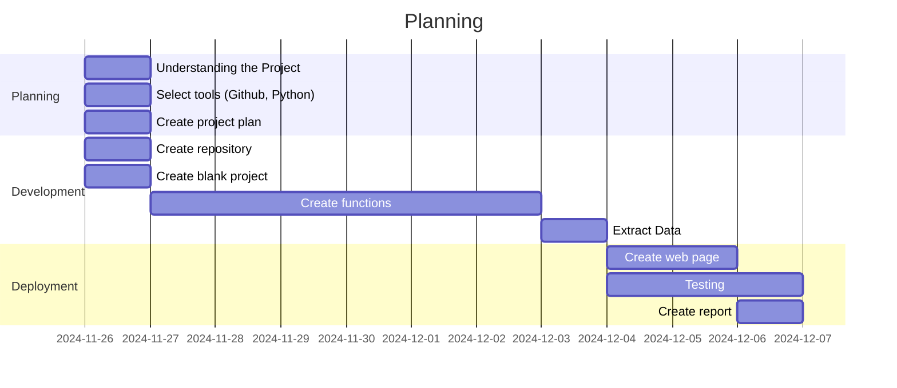

# ATM Project
[Click here to use the app](https://atmproject.streamlit.app/)

## Objectives

- Show statistics about the separation between flights and wether or not the separation requirements are fulfilled.
    - Radar
    - Wake
    - Letter of Agreement
- Show statistics of the position and corrected altitude when the departure (from 24L) starts turning
- Show whether radial 234 is crossed when departing 
- Show IAS of departures at 850, 1500 and 3500 ft for both runways
- Show the corrected altitude and IAS of traffic at threshold when departing at 24L and 06R
- Calculate the horizontal (stereographical) distance from departures to TMR-40 when departing from 24L


## Overview of Project
We have developed the following planning:

The tasks have been divided among the group members as can be seen [Here](https://github.com/users/Robertguarneros/projects/5)


## Functions

<details>
  <summary>View</summary>

### Miscellaneous functions

These are functions we use repeatedly within our calculations:
- `load_departures`: this function is in charge of loading the excel contaning the departure list and returns a list of the departures.
- `load_flights`: this function is in charge of loading the `csv` files that contain the flight data. It returns a matrix with the data.
- `load_24h`: this function is in charge of loading all the `csv` files to be able to view data for 24 hours. It returns a matrix with the data.
- `corrected_altitude`: this function is used to get the corrected altitude by receiving the barometric pressure setting and the flight level information. It returns the corrected altitude in feet.
- `get_stereographical_from_lat_lon_alt`: this function helps us convert the coordinates to stereographical, it has three subfunctions which are self explanatory:
    - `geodesic_to_geocentric`
    - `geocentric_to_system_cartesian`
    - `system_cartesian_to_system_stereographical`


### Separation between flights
This process is designed to evaluate and compare the separation between consecutive flights departing from the same runway, ensuring that the separation distances comply with radar, wake turbulence, and LoA (Letter of Agreement) regulations. Below are the key functions used to achieve this:
- `extract_contiguous_pairs`: processes the flight data (2305_02_dep_lebl.xlsx) to identify consecutive flights departing from the same runway within a time threshold (4 minutes by default). It groups the flights based on their departure runway (24L or 06R) and prepares additional flight details.
- `calculate_min_distances`: aims to compute the minimum distances between pairs of flights using processed flight trajectories (`get_trajectory_for_airplane`). This calculation takes into account the stereographic coordinates of the flights, filtering out those that are within specific areas on the runway thresholds to know when to start making calculations.
- `compare_radar_separation`: compare the separation distance between consecutive flights and checks if it complies with the minimum radar separation distance (3 NM). It returns whether each pair of flights meets the minimum separation requirement and the percentage of compliant pairs.
- `compare_wake_separation`: considers the wake turbulence separation distances based on aircraft types (Super Heavy, Heavy, Medium, and Light). It compares and returns the actual separation distance between pairs of flights against the required distance for their respective aircraft wakes. In cases that do not appear in the table, such as average wake followed by average wake, 3 NM has been applied since minimum separation per wake is not applied.
- `compare_loa_separation`: compare the separation between flights using a table based on aircraft type and their SID (Standard Instrument Departure) group. Returns the distances between consecutive flights, in addition to information on the type of aircraft of each flight and the SID corresponding to each one, thus knowing the data to be able to assign the minimum distances shown in the LoA table.

<details>
  <summary>Flowchart!</summary>

  The flow of the function would look like this:

  ```mermaid
  flowchart TD
      A[Start] 
      B(extract_contiguous_pairs)
      A-->B2(load_departures)
      B2-->B -->A2
      A2(load_flights) --> C
      C(calculate_min_distances)
      C --> D1(compare_radar_separation)
      C --> D2(compare_wake_separation)
      C --> D3(compare_loa_separation)
      D4(SID groups)-->D3
      D5(Aircraft type)-->D3
```
</details>

### Position and Altitude turns
This set of functions processes and analyzes flight data to detect the initiation of turns after departing from runway 24L. It examines interpolated trajectories to identify the first point where an aircraft begins its turn by calculating cumulative changes in heading, roll angle (RA), and true track angle (TTA) over a 2-second interval. When certain thresholds are exceeded, the turn is detected, and a vector is generated with the aircraft's ID and position at the moment the turn starts. 
- `correct_altitude_for_file`: this function is called to get the corrected altitude for the whole matrix and not just one flight, it uses function `corrected_altitude` described previously.
- `get_trajectory_for_airplane`: this function takes the matrix of flights and makes a dictionary that has the flight ID and within, the coordinates of the trajectory. This allows us to quickly interpolate or plot trajectories since the data for one flight is already in one place and not spread.
- `filter_empty_trajectories`: this function filters any flight that might be empty.
- `filter_departures_by_runway`: this function returns a list containing the identifiers of the flights that depart from 24L and another list for 06R.
- `filter_trajectories_24L`: filters trajectories to include only flights departing from runway 24L and limits the trajectory points to those around the departure, which is sufficient to capture the initial turn.
- `interpolate_trajectories`: this function helps us interpolate the coordinates, in our case we decided to use an interpolation of the position, velocity and corrected altitude every 0.5 seconds.
- `detect_turn_start_from_runway_24L`: this function processes interpolated trajectories and detects the first point where an aircraft initiates a turn after departing from runway 24L. It calculates cumulative changes in heading, roll angle (RA), and true track angle (TTA) over time, comparing values over a 2-second interval (four data points). A turn is detected if the cumulative changes in heading exceed 8 degrees, RA exceed 5 degrees, or TTA exceed 15 degrees.

<details>
  <summary>Flowchart!</summary>

  The flow of the function would look like this:

  ```mermaid
  block-beta
    columns 5
    Start space load_departures space load_flights 
    space space space space space  
    filter_departures_by_runway space correct_altitude_for_file space load_24h
    space space space space space
    get_trajectory_for_airplane space filter_empty_trajectories space filter_trajectories_24L 
    space space space space space
    End space detect_turn_start_from_runway_24L space interpolate_trajectories

    Start --> load_departures
    load_departures --> load_flights
    load_flights --> load_24h
    load_24h --> correct_altitude_for_file
    correct_altitude_for_file --> filter_departures_by_runway
    filter_departures_by_runway --> get_trajectory_for_airplane
    get_trajectory_for_airplane --> filter_empty_trajectories
    filter_empty_trajectories --> filter_trajectories_24L
    filter_trajectories_24L --> interpolate_trajectories
    interpolate_trajectories --> detect_turn_start_from_runway_24L
    detect_turn_start_from_runway_24L --> End
```
</details>

### Radial Crossing
This function analyzes flight trajectories to determine if they cross th R-234 radial of the DVOR/DME BCN. A vector is generated containing the flight ID and a boolean value indicating whether the radial is crossed. The different functions involved are:
- `correct_altitude_for_file`: this function is called to get the corrected altitude for the whole matrix and not just one flight, it uses function `corrected_altitude` described previously.
- `get_trajectory_for_airplane`: this function takes the matrix of flights and makes a dictionary that has the flight ID and within, the coordinates of the trajectory. This allows us to quickly interpolate or plot trajectories since the data for one flight is already in one place and not spread.
- `filter_empty_trajectories`: this function filters any flight that might be empty.
- `filter_departures_by_runway`: this function returns a list containing the identifiers of the flights that depart from 24L and another list for 06R.
- `filter_trajectories_24L`: filters trajectories to include only flights departing from runway 24L and limits the trajectory points to those around the departure, which is sufficient to capture the initial turn.
- `crosses_fixed_radial`: checks if flight trajectories cross the predefined radial line based on coordinated. To acheive this it uses two functions: `dms_to_decimal` to convert coordinates of the radial from degrees, minutes, and seconds to decimal format, and `side_of_line` to calculate the relative position of a point with respect to the R-234 of the DVOR/DME BCN.
Additionally, the crossing trajectories and the radial are visualized to verify the results visually.

<details>
  <summary>Flowchart!</summary>

  The flow of the function would look like this:

  ```mermaid
  block-beta
    columns 5
    Start space load_departures space load_flights 
    space space space space space  
    filter_departures_by_runway space correct_altitude_for_file space load_24h
    space space space space space
    get_trajectory_for_airplane space filter_empty_trajectories space filter_trajectories_24L 
    space space space space space
    space space End space crosses_fixed_radial

    Start --> load_departures
    load_departures --> load_flights
    load_flights --> load_24h
    load_24h --> correct_altitude_for_file
    correct_altitude_for_file --> filter_departures_by_runway
    filter_departures_by_runway --> get_trajectory_for_airplane
    get_trajectory_for_airplane --> filter_empty_trajectories
    filter_empty_trajectories --> filter_trajectories_24L
    filter_trajectories_24L --> crosses_fixed_radial
    crosses_fixed_radial --> End
```
</details>

### IAS at different altitudes
This process takes flight and departure data as input, analyzes them through multiple steps, and classifies IAS (Indicated Airspeed) values for altitudes 850 ft, 1500 ft, and 3500 ft based on the departure runway (06R or 24L). The classified IAS values are returned as two dictionaries (ias_06R and ias_24L), each containing IAS data grouped by target altitudes. Here’s a step-by-step breakdown of the different functions involved:
- `correct_altitude_for_file`: this function is called to get the corrected altitude for the whole matrix and not just one flight, it uses function `corrected_altitude` described previously.
- `filter_departures_by_runway`: this function returns a list containing the identifiers of the flights that depart from 24L and another list for 06R.
- `get_trajectory_for_airplane`: this function takes the matrix of flights and makes a dictionary that has the flight ID and within, the coordinates of the trajectory. This allows us to quickly interpolate or plot trajectories since the data for one flight is already in one place and not spread.
- `filter_empty_trajectories`: this function filters any flight that might be empty.
- `interpolate_trajectories`: this function helps us interpolate the coordinates, in our case we decided to use an interpolation of the position, velocity and corrected altitude every 0.5 seconds. This is because we wanted to achieve a high precision of detections.
- `extract_IAS_for_altitudes`: it extracts IAS values for specific target altitudes (850, 1500 and 3500 ft) from interpolated flight trajectories.

<details>
  <summary>Flowchart!</summary>

  The flow of the function would look like this:

  ```mermaid
  block-beta
    columns 5
    Start space load_departures space load_flights 
    space space space space space  
    filter_departures_by_runway space correct_altitude_for_file space load_24h
    space space space space space
    get_trajectory_for_airplane space filter_empty_trajectories space interpolate_trajectories 
    space space space space space
    space space End space extract_IAS_for_altitudes

    Start --> load_departures
    load_departures --> load_flights
    load_flights --> load_24h
    load_24h --> correct_altitude_for_file
    correct_altitude_for_file --> filter_departures_by_runway
    filter_departures_by_runway --> get_trajectory_for_airplane
    get_trajectory_for_airplane --> filter_empty_trajectories
    filter_empty_trajectories --> interpolate_trajectories
    interpolate_trajectories --> extract_IAS_for_altitudes
    extract_IAS_for_altitudes --> End
```
</details>

### Altitude and IAS at threshold
This function is composed of multiple smaller functions that together achieve the goal of getting the corrected altitude and IAS when crossing the threshold of the runway. The order of these functions is:
- `load_departures`: to load the departures.
- `load_flights`: to load only the time frame the user wants to see.
- `load_24h`: to load the whole day and allow the user to view all data.
- `filter_departures_by_runway`: this function returns a list containing the identifiers of the flights that depart from 24L and another list for 06R.
- `correct_altitude_for_file`: this function is called to get the corrected altitude for the whole matrix and not just one flight, it uses function `corrected_altitude` described previously.
- `get_trajectory_for_airplane`: this function takes the matrix of flights and makes a dictionary that has the flight ID and within, the coordinates of the trajectory. This allows us to quickly interpolate or plot trajectories since the data for one flight is already in one place and not spread.
- `filter_empty_trajectories`: this function filters any flight that might be empty.
- `interpolate_trajectories`: this function helps us interpolate the coordinates, in our case we decided to use an interpolation of the position, velocity and corrected altitude every 0.5 seconds. This is because we wanted to achieve a high precision of detections.
- `filter_trajectories_by_runway`: this function divides the filtered trajectories by runway so we can show data separately. 
- `get_corrected_altitude_and_ias_at_threshold`: this function is the one in charge of detecting when a flight crosses the threshold, we decided to go with the area approach for maximum precision. The coordinates we used were the following:

```python
threshold_06R_area = {
        "min_lat": 41.291979,  # Bottom latitude
        "max_lat": 41.293154,  # Top latitude
        "min_lon": 2.103089,   # Left longitude
        "max_lon": 2.105704    # Right longitude
    }
    threshold_24L_area = {
        "min_lat": 41.281430,  # Bottom latitude
        "max_lat": 41.282578,  # Top latitude
        "min_lon": 2.072046,   # Left longitude
        "max_lon": 2.074564    # Right longitude
    }
```
<details>
  <summary>Flowchart!</summary>

  The flow of the function would look like this:

  ```mermaid
  block-beta
   columns 5
   Start space load_departures space load_flights 
   space space space space space  
   correct_altitude_for_file space filter_departures_by_runway space load_24h
   space space space space space
   get_trajectory_for_airplane space filter_empty_trajectories space interpolate_trajectories 
   space space space space space
   End space get_corrected_altitude_and_ias_at_threshold space filter_departures_by_runway

    Start --> load_departures
    load_departures --> load_flights
    load_flights --> load_24h
    load_24h --> filter_departures_by_runway
    filter_departures_by_runway --> correct_altitude_for_file
    correct_altitude_for_file --> get_trajectory_for_airplane
    get_trajectory_for_airplane --> filter_empty_trajectories
    filter_empty_trajectories --> interpolate_trajectories
    interpolate_trajectories --> filter_trajectories_by_runway
    filter_trajectories_by_runway --> get_corrected_altitude_and_ias_at_threshold
    get_corrected_altitude_and_ias_at_threshold --> End
```
</details>

### Horizontal distance to TMR-40

This function is composed of multiple smaller functions that together achieve the goal of calculating the horizontal distance to TMR-40:

- `load_departures`: to load the departures.
- `load_flights`: to load only the time frame the user wants to see.
- `load_24h`: to load the whole day and allow the user to view all data.
- `correct_altitude_for_file`: this function is called to get the corrected altitude for the whole matrix and not just one flight, it uses function `corrected_altitude` described previously.
- `get_trajectory_for_airplane`: this function takes the matrix of flights and makes a dictionary that has the flight ID and within, the coordinates of the trajectory.
- `filter_empty_trajectories`: this function filters any flight that might be empty.
- `trajectories_to_stereographical`: this function is used to transform all the trajectory points into stereographical coordinates by calling previously described `get_stereographical_from_lat_lon_alt` function.
- `filter_departures_by_runway`: this function returns a list containing the identifiers of the flights that depart from 24L and another list for 06R. In this case we keep only the 24L since that is the one we are interested in.
- `calculate_min_distance_to_TMR_40_24L`: this function returns the minimum distance between a flight during its trajectory and the TMR-40.

<details>
  <summary>Flowchart!</summary>

  The flow of the function would look like this:

  ```mermaid
  block-beta
   columns 5
   Start space load_departures space load_flights 
   space space space space space  
   get_trajectory_for_airplane space correct_altitude_for_file space load_24h
   space space space space space
   filter_empty_trajectories space trajectories_to_stereographical space get_stereographical_from_lat_lon_alt
   space space space space space
   End space calculate_min_distance_to_TMR_40_24L space filter_departures_by_runway

    Start --> load_departures
    load_departures --> load_flights
    load_flights --> load_24h
    load_24h --> correct_altitude_for_file
    correct_altitude_for_file --> get_trajectory_for_airplane
    get_trajectory_for_airplane --> filter_empty_trajectories
    filter_empty_trajectories --> trajectories_to_stereographical
    trajectories_to_stereographical --> get_stereographical_from_lat_lon_alt
    get_stereographical_from_lat_lon_alt --> filter_departures_by_runway
    filter_departures_by_runway --> calculate_min_distance_to_TMR_40_24L
    calculate_min_distance_to_TMR_40_24L --> End
  

```
</details>
</details>

## Project Assessment
This project was particularly engaging as it challenged us to create functions to extract specific data and statistics, such as those related to flight separation, altitude corrections, and speed metrics at various flight phases. It allowed us to be creative in designing methods to present the data in a clear and engaging way. We developed efficient and fast algorithms to process the required information. Given the flexibility to choose the type of application, we opted for a web app due to its accessibility and broad reach. While the limited time frame posed challenges, we were deeply satisfied with the overall outcome of the project. It was a fulfilling experience that combined technical development with creative problem-solving.


## For Developers

<details>
  <summary>View</summary>


### First time installing Project
1. Clone repo: `git clone https://github.com/Robertguarneros/ATM.git`
2. Change into the project directory 
3. Install the dependencies: `pip install -r requirements.txt`
4. Run proyect with `streamlit run .\Home.py`

### Project Structure

<details>
  <summary>View</summary>

```
ATM/
│   .DS_Store
│   .flake8
│   .gitignore
│   Home.py
│   project.toml
│   README.md
│   requirements.txt
│   
├───assets
│   │   .DS_Store
│   │   logo_eurocontrol.png
│   │
│   ├───CsvFiles
│   │       P3_00-04h.csv
│   │       P3_04_08h.csv
│   │       P3_08_12h.csv
│   │       P3_12_16h.csv
│   │       P3_16_20h.csv
│   │       P3_20_24h.csv
│   │
│   └───InputFiles
│           2305_02_dep_lebl.xlsx
│           Tabla_Clasificacion_aeronaves.xlsx
│           Tabla_misma_SID_06R.xlsx
│           Tabla_misma_SID_24L.xlsx
│
├───functions
│       functions1.py
│       functions2.py
│       functions3.py
│
├───pages
|       General_Information.py
|       About.py
│       Altitude_and_IAS_at_runway_threshold.py
│       Horizontal_Distance_to_TMR-40.py
│       IAS_at_different_Altitudes.py
│       Position_and_Altitude_when_Turning.py
│       Radial_Crossing.py
│       Separation_Losses.py
```
</details>

 
### Libraries
The main Python libraries used were:
- streamlit
- pandas
- numpy
- csv
- altair
- collections
- defaultdir

### Tools Used

We are also using the following tools:
- `isort`: to order imports alphabetically, use with `isort .`
- `black`: formatter, use with `black .`
- `flake8`: linting tool, use with `flake8 .`


### Requirements
To generate requirement list use:
`pip freeze > requirements.txt`

#### Install Requirements

The requirements can be installed from the requirements.txt file:
`pip install -r requirements.txt`

#### Verify Requirements
`pip list`

</details>
